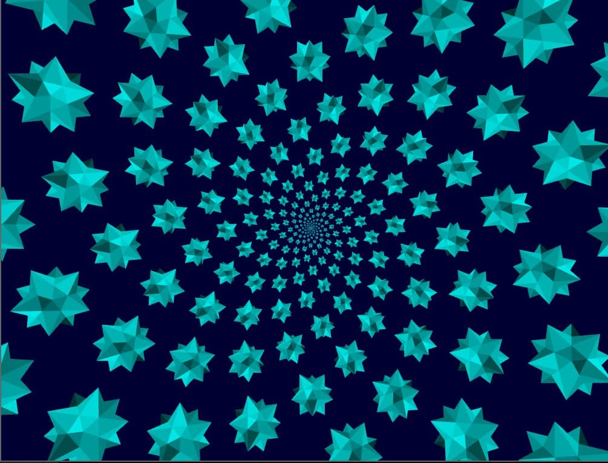
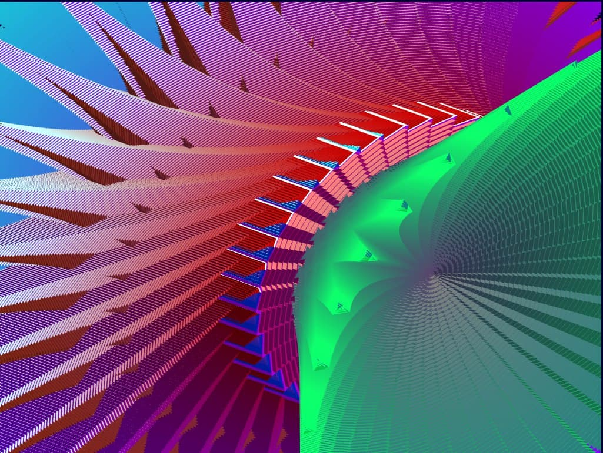
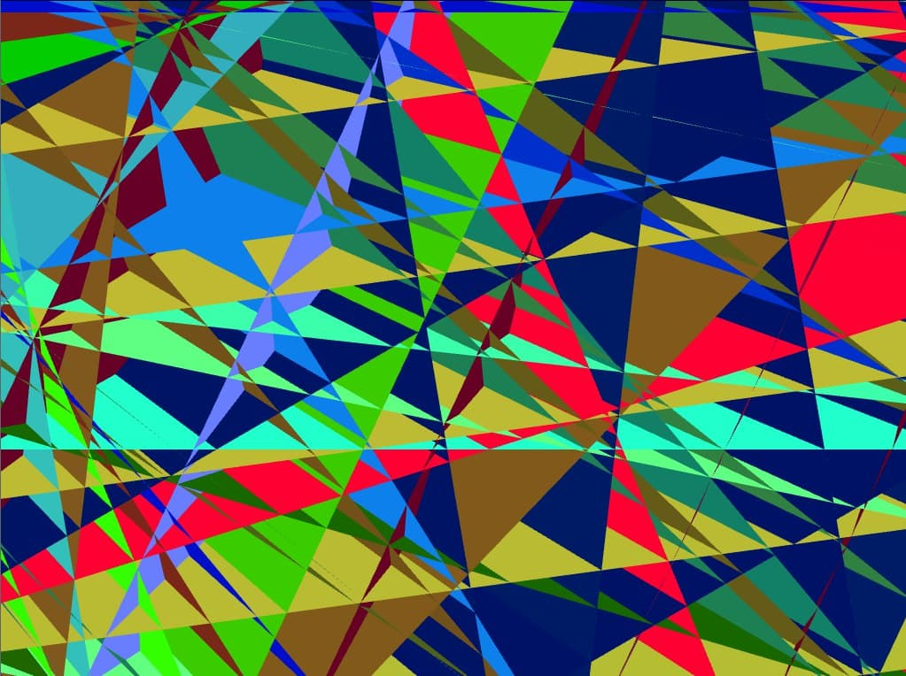
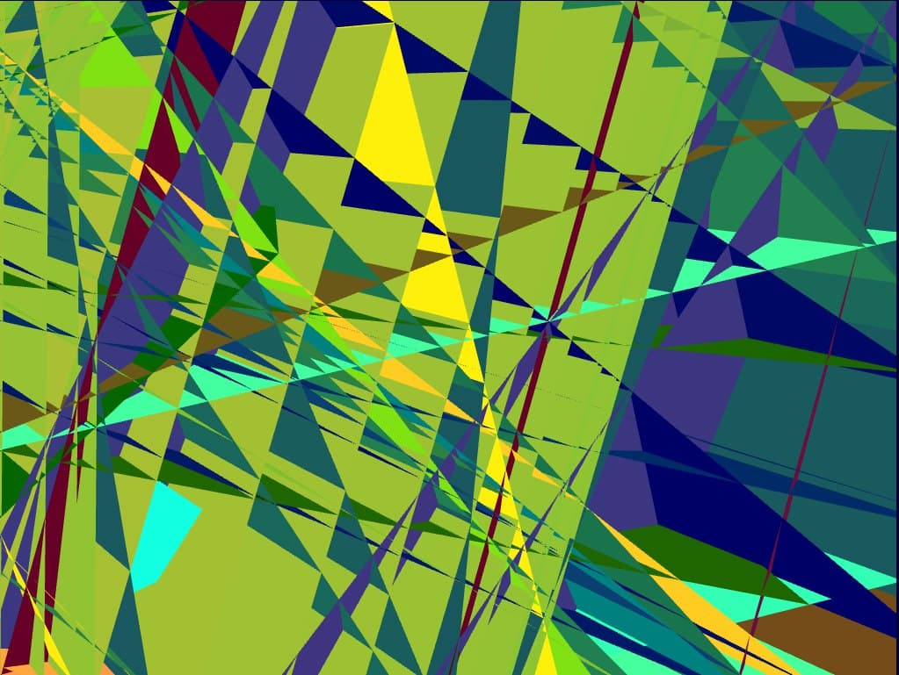

# Class Projects
This repository is a collection of some of the projects I did as part of my graduate school classes.
## Computer Architecture
One of the project options for this class was to write and instruction set simulator. I chose the 6502 instruction set due to its simplicity and the fact that it was widely used in a large portion of 8 bit personal computers. I also decided to write the [simulator](architecture/sim.asm) in 6502 assembly to run on a Commodore 64 emulator because I thought it would be funny. There wasn't enough time to implement the complete instruction set but it was still satisfying being able to run some small programs (extremely slowly).

## Game Theory
This project involved applying a game theory concept to our research domain. I had a dataset of mutation coverage scores lying around, so I thought it would be interesting to use Shapley values to calculate how much each individual test/test class contributes to the overall coverage score. The results are written up [here](game-theory/test_contributions.pdf). Both mutation score and Shapley values are expensive to calculate, so this approach is probably not suitable for integrating into everyday developer workflow.

## Graphics
We had to do several projects in this class, but my favorite one involved creating a complex shape and arranging that shape into some sort of pattern. The shape had to be formed by applying transformations to individual triangles, so I had to do some calculations to get the lengths and angles correct. The rest of the pictures are other attempts I was messing around with but never turned in, but I think they look pretty cool as well.

